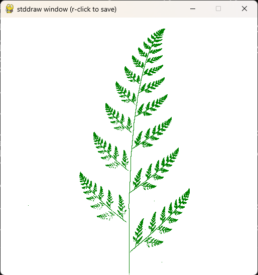
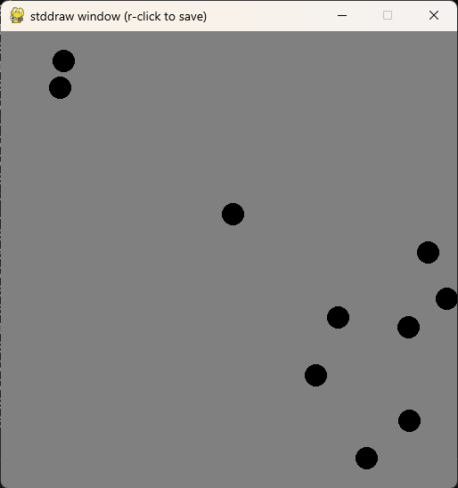
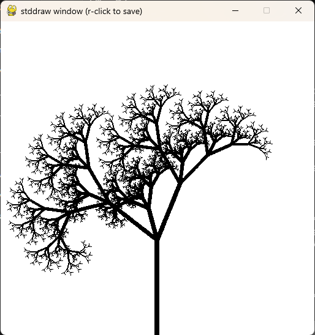

# **🎓 Princeton University Python GUI Library Problems | سوالات کتابخانه گرافیکی پایتون دانشگاه پرینستون**

**A university project in which three questions related to Python graphics libraries written by Princeton University are solved.**

**یک پروژه دانشگاهی که در آن سه سوال مربوط به کتابخانه‌های گرافیکی پایتون نوشته شده توسط دانشگاه پرینستون حل میشود.**

# 💬 **نکات پروژه**

* عکس‌های برنامه در دایرکتوری ScreenShots قرار دارند.
* برای اجرا برنامه، به پایتون بالاتر از نسخه 3.6 نیاز دارید.
* کتابخانه‌های مورد نیاز در فایل requirements.txt قرار دارند. این کتابخانه ها از pip قابل نصب نیستند و باید از سایت دانشگاه پرینستون آن‌ها را دانلود کنید. همچنین این فایل‌ها در کنار برنامه‌ها قرار دارند.
* برای دسترسی به همه‌ی پروژه‌های دانشگاهی من، به این لینک مراجعه کنید:

👈🏻 **[پروژه‌های دانشگاهی من](https://github.com/bestmahdi2/Uni__Bachelors_SKU_Path)**

# 📝 **توضیحات پروژه**

# 🖼 **عکس‌های پروژه**

  
  
  
  
  

